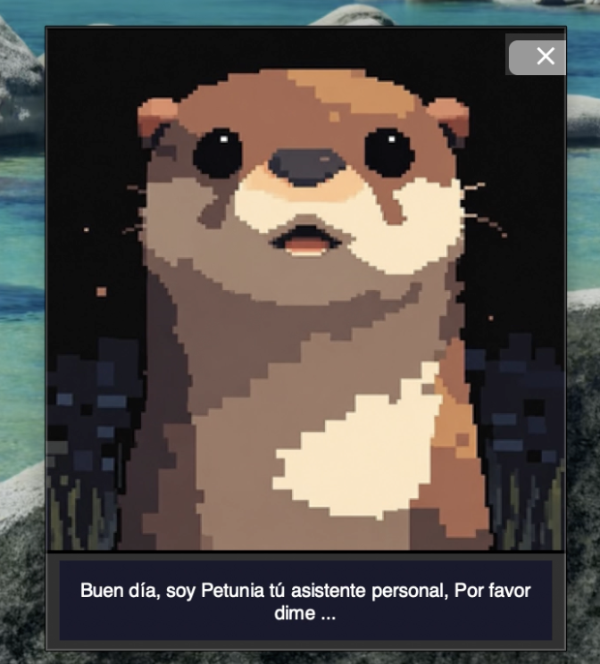
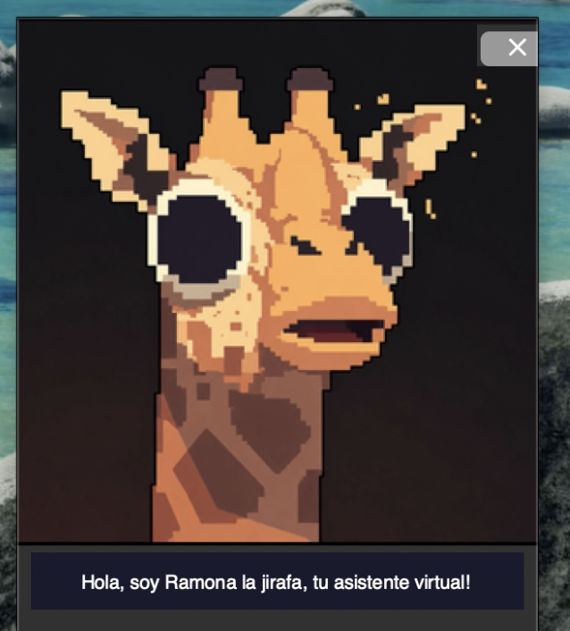
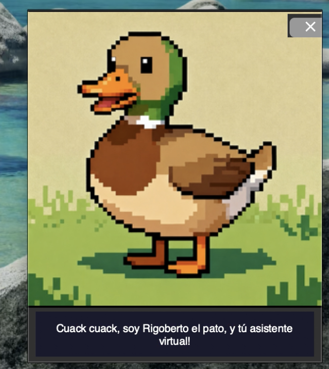

# 🦦 Petunia | Asistente Virtual con IA en Python

Aplicación de escritorio desarrollada en Python que combina reconocimiento de voz, síntesis de voz, inteligencia artificial y personajes animados interactivos.

El asistente permite realizar búsquedas en internet, consultar Wikipedia, reproducir videos de YouTube, controlar funciones del sistema y responder preguntas mediante Gemini AI.

Además, el usuario puede cambiar entre tres personajes diferentes:

🦦 Petunia la Nutria
🦒 Ramona la Jirafa
🦆 Rigoberto el Pato

---

# ✨ Características

✅ Reconocimiento de voz en español

✅ Síntesis de voz mediante voces del sistema

✅ Integración con Gemini AI

✅ Personajes animados intercambiables

✅ Animación facial sincronizada mientras habla

✅ Burbuja de texto interactiva

✅ Reproducción de videos de YouTube por voz

✅ Búsquedas en internet

✅ Consultas en Wikipedia

✅ Traducción automática al español

✅ Consulta de precios de acciones

✅ Capturas de pantalla por comando de voz

✅ Control de volumen multimedia

✅ Apertura de aplicaciones del sistema

✅ Interfaz flotante desarrollada con Tkinter

---

# 🖼️ Vista General del Proyecto

El asistente cuenta con:

* Personaje animado flotante
* Burbuja de conversación
* Reconocimiento de voz
* Respuestas habladas
* Integración con inteligencia artificial
* Control multimedia
* Cambio dinámico de personajes

---

# 🛠️ Tecnologías Utilizadas

* Python
* Tkinter
* Pillow (PIL)
* SpeechRecognition
* Google Gemini API
* PyWhatKit
* Wikipedia
* BeautifulSoup
* Requests
* Deep Translator
* PyAutoGUI
* yFinance
* Threading
* Dotenv

---

# 📌 Funcionalidades Principales

## 🎙️ Reconocimiento de Voz

El asistente escucha instrucciones mediante el micrófono y las convierte en texto utilizando SpeechRecognition.

Ejemplos:

```bash
qué hora es
qué día es
```

```bash
busca en internet Python
```

```bash
reproduce música relajante
```

---

## 🤖 Inteligencia Artificial

El proyecto utiliza Gemini para responder preguntas realizadas por el usuario.

Ejemplo:

```bash
pregúntale a la IA qué es una galaxia
```

Las respuestas se generan automáticamente en español y de forma resumida.

---

## 🌐 Búsquedas en Internet

El asistente puede:

* Abrir Google
* Buscar información
* Leer resultados encontrados
* Traducir contenido automáticamente

Ejemplo:

```bash
busca en internet Tame Impala
```

---

## 📚 Consultas en Wikipedia

Permite obtener resúmenes automáticos desde Wikipedia.

Ejemplo:

```bash
busca en wikipedia Alan Turing
```

Si la página no existe en español, intenta buscarla en inglés y traducirla automáticamente.

---

## 🎬 Control Multimedia

El asistente puede reproducir videos en YouTube mediante comandos de voz.

Ejemplos:

```bash
reproduce música clásica
```

```bash
pausa
```

```bash
play
```

```bash
siguiente
```

---

## 🦦 Sistema de Personajes

El usuario puede cambiar entre tres asistentes diferentes.

### Petunia la Nutria

```bash
cambia a Petunia
```

### Ramona la Jirafa

```bash
cambia a Ramona
```

### Rigoberto el Pato

```bash
cambia a Rigoberto
```

Cada personaje cuenta con:

* Diseño propio
* Animación independiente
* Voz personalizada

---

## 📈 Consulta de Acciones

Permite consultar precios de acciones en tiempo real mediante Yahoo Finance.

Ejemplo:

```bash
precio de las acciones de Apple
```

---

## 📸 Capturas de Pantalla

El asistente puede guardar capturas automáticamente.

Ejemplo:

```bash
captura
```

---

## 🔊 Control de Volumen

Permite modificar el volumen mediante comandos de voz.

Ejemplos:

```bash
subir volumen
```

```bash
bajar volumen
```

---

# 📂 Estructura General del Proyecto

```bash
📁 Petunia

 ┣ 📄 asistente.py
 ┣ 📄 widget_nutria.py
 ┣ 📄 .env
 ┣ 📄 .env.example
 ┣ 📄 .gitignore
 ┣ 📄 README.md

 ┣ 🖼️ cerrada.png
 ┣ 🖼️ entreabierta.png
 ┣ 🖼️ abierta.png

 ┣ 🖼️ jarifa_cerrada.png
 ┣ 🖼️ jarifa_entreabierta.png
 ┣ 🖼️ jarifa_abierta.png

 ┣ 🖼️ pato_cerrado.png
 ┣ 🖼️ pato_entreabierto.png
 ┗ 🖼️ pato_abierto.png
```

---

# ▶️ Cómo Ejecutar el Proyecto

## 1️⃣ Clona el repositorio

```bash
git clone URL_DEL_REPOSITORIO
```

---

## 2️⃣ Entra a la carpeta

```bash
cd Petunia
```

---

## 3️⃣ Instala las dependencias

```bash
pip install -r requirements.txt
```

---

## 4️⃣ Configura tu API Key

Crea un archivo `.env`

```env
GEMINI_API_KEY=tu_api_key
```

---

## 5️⃣ Ejecuta el proyecto

```bash
python asistente.py
```

---

# 🎯 Objetivo del Proyecto

Este proyecto fue desarrollado con fines educativos para practicar:

* Programación en Python
* Interfaces gráficas con Tkinter
* Reconocimiento de voz
* Animaciones GUI
* Consumo de APIs
* Inteligencia Artificial
* Automatización de tareas
* Manejo de hilos (Threading)

---

# 📸 Capturas del Proyecto







---

# 👩‍💻 Autor

Desarrollado por Eve 💫

---

# ⭐ Extras

Una de las características más llamativas del proyecto es que los personajes animan su boca mientras hablan y muestran sus respuestas dentro de una burbuja de diálogo, simulando el comportamiento de un pequeño asistente virtual de escritorio.

Además, el sistema combina tecnologías de reconocimiento de voz, automatización, búsqueda web e inteligencia artificial en una única aplicación interactiva.

